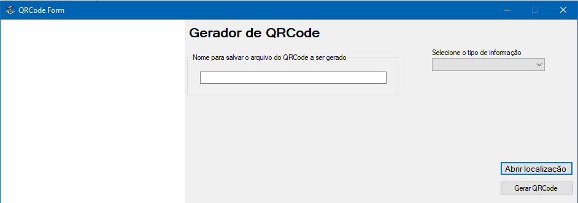

# Apresentação

Este programa tem a finalidade de gerar imagens de QRCode baseado nas informações inseridas, e após gerado, ele grava automaticamente na pasta **"QRCode"** do programa, na extensão **.jpg**.

# Requisitos

Para executar o programa é necessário:
* Ter Windows instalado, qualquer versão.
* Ter o Framework .Net 4.0 instalado.

# Instalação

Não há necessidade de instalação, basta executar o **QRCodeForm.exe**.

# Como utilizar

O programa possui dois campos:  
* **Informe um nome para o arquivo de QRCode**: Campo para ser informado o nome do arquivo de QRCode a ser gerado, para auxiliar na identificação;
* **Selecione o tipo de informação**: Campo para selecionar o tipo de informação a ser gravado no QRCode, para melhor utilização quando usado leitores instalados em mobile.
* **Informe o texto a ser gravado no QRCode**: Campo para informar o conteúdo a ser gravado no QRCode, conforme o tipo de dado selecionado no combobox, o numero de campo varia conforme o tipo selecionado;

Após preencher as informações necessárias, basta clicar no botão **"Gerar QRCode"**, e neste momento, o QRCode será gerado com o conteudo informado e salvará em um arquivo **.jpg** com o nome informado, dentro da pasta **\\QRCode** localizado juntamente com o programa **QRCodeForm.exe**.  Após gerado o código, o programa apresentará no formulario o QRCode gerado, e se desejar, pode abrir sua localização pelo botão **"Abrir localização"**.

# Autor

Ezequiel da Silva Daniel  
[Blog](https://ezequieldaniel.wordpress.com/)  
[Email](ezequielsd@gmail.com)

# Licença

[MIT]

# Release

A versão Release do programa, apenas executável, pode ser baixado no link abaixo:

[QRCode Form](/Release/QRCodeForm.zip)
